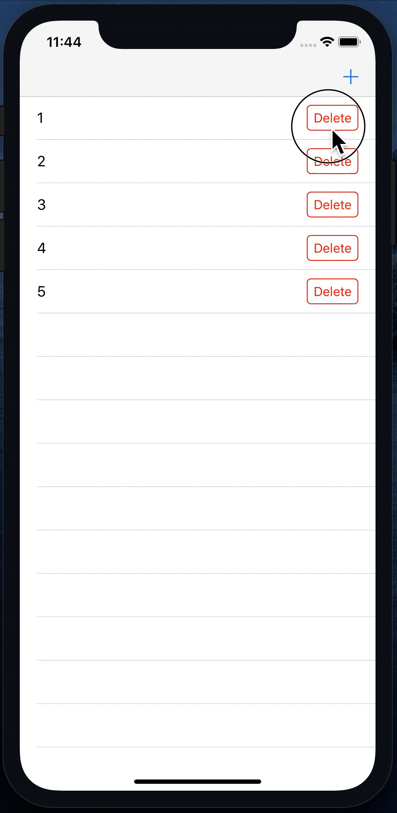

# DI Part 2 - Pass Value

### Before Assignment

在兩個不同的物件之間傳遞訊息或事件，在 iOS 裡面，是一個重要的課題。在這個專案裡面，我們會練習兩個 Case:

1. Pass Value Between Different View Controller.
2. Pass Value From UITableViewCell to UIViewController.

### Assignment
請參考下面的 Gif 檔，建立一個相同的 App。



**第一頁**：
1. 內容為 UITableView, 四邊貼齊 SafeArea。

2. 會有一個 UITableViewCell，左側有一個 UILabel, 右側有一個 UIButton，constraint 沒有特別定義，可以自由發揮。

3. App 開啟時，預設會有 4 個 Cell, Cell 的文字分別是 2, 3, 4, 5。

4. 按下 Cell 裡的右側按鈕，會將 Cell 刪除，這個功能請分別以下列三種方法實現：

  ```
  1. Closure
  2. Target-Action (Target 請設定在擁有 UITableView 的 View Controller 上)
  3. Delegate Pattern
  ```

5. Navigation Bar 上有一個 **+** 按鈕，點擊會推出第二頁。

6. 點擊 UITableViewCell 會推出第二頁，並把 Cell 內的文字傳到第二頁。

**第二頁**：
1. **請使用程式碼實現這一頁的 UI**
2. 內容為一個 UITextField, 一個 UIButton, Layout 需求如下：
    - UITextfield
      - top to safe area: 100
      - Width 為 SuperView 的 2/3
      - 水平置中
      - Height 為 40

    - UIButton
      - Width 為 SuperView 的 2/3
      - 水平置中
      - Height 為 40
      - top 在 super view 的 centerYAnchor 的下方 20 pt

3. 如果第一頁有傳值過來，則將之顯示在 TextField 上。
4. 當按下按鈕的時候，請將值傳回第一頁。

    - 如果第二頁是因為點擊第一頁 Cell 而出現，則按下按鈕會將原本 Cell 的文字修改成 TextField 的內容。

    - 如果第二頁是因為點擊第一頁右上角加號按鈕而出現，則按下按鈕將會新增一個 Cell 在第一頁。

    - 請用下列兩種方法實現以上功能：

    ```
    1. Delegate Pattern
    2. Closure
    ```

    - 不管是從哪個方式過來，按下按鈕都會退回第一頁。
